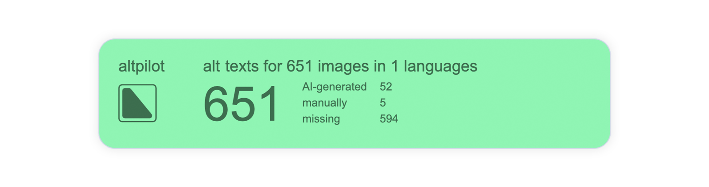
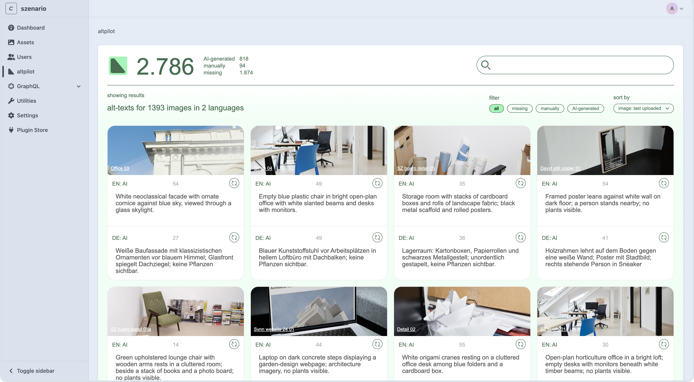

<br />
<div align="center"><strong>altpilot: alt text on autopilot</strong></div>


<div align="center"><strong>AI-powered alt text generation built into Craft CMS.</strong></div>
<div align="center">Generate faster, review in context, and scale accessibility across large image libraries with full control.</div>

<br />
<div align="center">
  <sub>Made possible by</sub>
  <sub><br />
  <a href="https://www.szenario-design.com/" target="_blank">
    </a>
  </sub><br /><br />
  <sub>The team behind the magic</sub><br />
  <sub><a href="https://twitter.com/smonist">Simon Wesp</a></sub>
  <sub><a href="https://twitter.com/thomasbendl">Thomas Bendl</a></sub>
  <sub>Erich Bendl</sub>
</div>

<br />

## Features ✨

- Dedicated UI for reviewing and managing generated alt text
- Inline frontend editing workflow
- Native Craft CMS integration for assets and action menus
- CLI commands for batch generation and maintenance
- Dynamic OpenAI rate-limit throttling for safer large runs
- Alt text status tracking across assets/sites
- Automatic generation for newly uploaded images

## Requirements 📋

- Craft CMS `5.0.0+`
- PHP `8.2+`
- Valid OpenAI API key with access to a vision-capable model
- Reliable Craft queue runner for production (CRON or daemon-based)

> altpilot uses Craft's queue system for generation jobs. For production, avoid relying only on browser-triggered queue execution.  
> Craft queue docs: https://craftcms.com/docs/5.x/system/queue.html#queue-runners

## Installation 📦

Install from the Craft Plugin Store or via Composer.

### Plugin Store

TODO: Add Plugin Store URL once published.

### Composer

```bash
# from your Craft project root
composer require szenario/craft-altpilot && php craft plugin/install altpilot
```

## Quickstart 🚀

1. Open `Settings -> Plugins -> altpilot`.
2. Add your OpenAI API key.
3. Select the asset volumes altpilot should process.
4. Run an initial generation pass:

```bash
php craft altpilot/missing
```

5. Make sure your queue runner is active:

```bash
php craft queue/run --verbose
```



## Configuration 🛠️

altpilot settings are available in the Craft control panel:

- **OpenAI API Key**: API key used for generation requests
- **Volumes**: limits processing to selected asset volumes
- **Inline Frontend Editing**: toggles frontend overlay
- **Prompt**: base prompt sent with each image
- **Prompt Role**: optional role/context
- **Prompt Focus**: optional domain-specific focus
- **OpenAI Model**: model used for alt text generation (recommended: `gpt-5-nano`)

## Model Recommendation and Cost

We recommend `gpt-5-nano` as the default model for most projects because it currently offers the best price/performance for alt text generation.

In our experience, generating 1,000 alt texts with `gpt-5-nano` costs less **$0.7 USD**.

> Pricing is an estimate, not a guarantee. Actual cost depends on your prompt length, image complexity, response length, and OpenAI pricing changes over time.

## Console Commands

altpilot includes CLI commands for batch operations:

```bash
# show available commands
php craft altpilot

# generate for one asset (optionally scoped by site)
php craft altpilot/asset <assetId> [--siteId=<id>]

# generate only missing alt text in configured volumes
php craft altpilot/missing [--siteId=<id>]

# regenerate all alt text (overwrites existing)
php craft altpilot/all [--siteId=<id>]

# regenerate all but optionally skip assets with manually set alt text
php craft altpilot/all [--siteId=<id>] --exclude-manual

# show status counts and queue overview
php craft altpilot/stats
```

## Queue and Performance Notes

For stable production behavior:

- Run queue workers via CRON or a daemon process
- Monitor queue health during large generation batches
- Keep PHP execution limits realistic for external API calls (`120s+` is safer than very low defaults)

## Support

- Issues: https://github.com/szenario-fordesigners/altpilot/issues
- Source: https://github.com/szenario-fordesigners/altpilot
- Developer: https://www.szenario-design.com/
